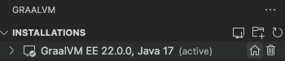
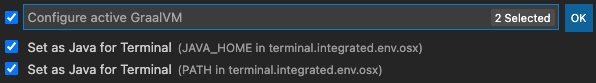

# GraalVM Tools for Java Extension

* [Extension Installation](#extension-installation)
* [GraalVM Installation](#graalvm-installation)
* [Java Development and Debugging](#java-development-and-debugging)
* [Integration with VisualVM](#integration-with-visualvm)
* [Native Image Building and Debugging](#native-image-building-and-debugging)
* [Popular Languages Support](#popular-languages-support)
* [Language Server Protocol Implementation](#language-server-protocol-implementation)
* [Debug Adapter Protocol Implementation](#debug-adapter-protocol-implementation)
* [Running and Debugging Polyglot Applications](#running-and-debugging-oolyglot-applications)
* [Extension Settings](#extension-settings)

[GraalVM Tools for Java](https://marketplace.visualstudio.com/items?itemName=oracle-labs-graalvm.graalvm) extension provides a full-fledged support for the Java language and, additionally, enables a polyglot environment in VS Code, making it a comfortable and convenient integrated development environment to work with.
Users can edit and debug applications written in the GraalVM supported languages (Java, JS, Ruby, R, and Python) in VS Code.

GraalVM Tools for Java Extension brings support for Java projects development and debugging in VS Code.
Besides Java, this extension provides editing and debugging capabilities for JavaScript and Node.js, Python, R, and Ruby languages.
The extension also provides the wizard to install GraalVM to simplify configuring the development environment.

The GraalVM Tools for Java extension is a prerequisite for the [Micronaut support in VS Code](https://marketplace.visualstudio.com/items?itemName=oracle-labs-graalvm.micronaut), which brings many more possibilities for Java developers.

Note: The extension is Technology Preview, and the development team is actively working on further improvements to provide high usability to developers.

## Extension Installation

To install the GraalVM Tools for Java extension in VS Code, do the following:

1. Navigate to Extensions in the left-hand side Activity Bar (or use the _Ctrl+Shift+X_ hot keys combination).
2. Search for "GraalVM" in the search field.
3. Once found, press Install. That action will install the GraalVM Tools for Java extension from the [VS Code Marketplace](https://marketplace.visualstudio.com/items?itemName=oracle-labs-graalvm.graalvm).
4. Reload when required.

Once installed, notice the "Gr" icon in the Activity Bar on the left.


## GraalVM Installation Wizard

With the extension installed, you already enable all necessary features for Java applications development and debugging.
However, to make use of all-inclusive capabilities that the extension provides, including support for ahead-of-time compilation, you need to install [GraalVM](https://www.graalvm.org/).
Any application that runs on a Java Virtual Machine (JVM) can run on GraalVM.
GraalVM includes a JDK based on the Java HotSpot VM, and integrates an optimizing, just-in-time (JIT) compiler, written in Java: the [Graal compiler](../../../reference-manual/java/compiler.md).
At run time, an application is loaded and executed normally by the JVM.

The GraalVM Tools for Java extension provides the wizard to install GraalVM.
Click the ""Gr" icon in the Activity Bar on the left.
A dialogue opens with the following choices:
  * **Download & Install GraalVM** will download and install any available GraalVM distribution.
  * **Add Existing GraalVM** lets you select an existing GraalVM installation from your local disk.


### Download and Install GraalVM

If you select **Download & Install GraalVM**, the installation wizard will ask you to:
  * Pick the GraalVM distribution: Community (free for all purposes) or Enterprise (free for evaluation and development)
  * Pick the GraalVM version: 22.x, 21.x, 20.x, or Latest Snapshot (Nightly Build)
  * Pick a Java version: 11 or 17
  * Select the destination folder

If you prefer GraalVM Community Edition, the installation wizard will download the package from [Github](https://github.com/graalvm/graalvm-ce-builds/releases) in the background and display the progress.

If you select GraalVM Enterprise Editon, you will be prompted to accept the Oracle Technology Network License Agreement and requested to enter your email address.
Providing your email address is mandatory.


The installation wizard will download the package from [Oracle Software Downloads](https://www.oracle.com/downloads/graalvm-downloads.html) in the background and display the progress.
If you are behind a proxy, setup your proxy configuration by the "Setup Proxy" command or by overriding the `http_proxy` and `https_proxy` environment variables.

At the same time, the "Install Optional GraalVM Components" window will pop up suggesting to install additional plugins to GraalVM:


Once you confirm, you are taken to the selection list:


Note: You can download and install multiple GraalVM distributions and components at the same time.

### Add Existing GraalVM

The **Add Existing GraalVM** action allows you to select the existing GraalVM installation from your local disk.
As in the previous installation scenario, you are prompted to set the GraalVM installation as default, and to install optional components, if not already installed.
**Add Existing GraalVM** can also be invoked by using an icon on the side of the **GRAALVM: INSTALLATIONS** panel.

### Set Default Java

Upon installation completion, the "Set Default Java" action is invoked.
To set a newly added GraalVM active. Click the “home” icon by the side of the installation:



Select both **Set as JAVA for Terminal** options in the **Configure active GraalVM** window:



Alternatively, you can invoke the same actions from **View**, then **Command Palette** (Command Palette can be also opened by pressing F1, or the _Ctrl+Shift+P_  hot keys combination for Linux, and _Command+Shift+P_ for macOS):
  * GraalVM: Download & Install GraalVM
  * GraalVM: Install GraalVM Component
  * GraalVM: Set Active GraalVM Installation


The **Download & Install GraalVM** action is a preferable way, because it eliminates the fuss around setting up environment variables and prepares the GraalVM runtime in VS Code for you.

Each registered GraalVM instance displays its installation location and all its available components.
The active one is placed on top.
Components are either installed or available for download - the context actions to install (the plus icon) or remove (the bucket icon) are displayed when hovering over the component name.

All registered GraalVM instances will be listed in the configuration file under **File** > **Preferences** > **Settings** (**Code** > **Preferences** > **Settings** on macOS).

The advantages of this installation model are:
- It permits multiple GraalVM and components installations at the same time.
- It allows an easy switch from one runtime version to another.
- It enables a quick removal of unnecessary GraalVM installations from VS Code global storage or even from your local disk.

<!-- 3. Get started with Java development and debugging -->

## Java Development and Debugging

GraalVM Tools for Java extension brings a complete support for the Java language development and debugging in VS Code.
Besides the regular features like auto completion, code navigation, refactoring, etc., this extension provides support for ahead-of-time compilation with GraalVM Native Image, integrates with VisualVM, and supports polyglot programming, which will be described later.

To start developing, compile, run and debug your Java applications, GraalVM should be the default Java runtime in VS Code.
You can install GraalVM as described in the [GraalVM Installation](README.md#graalvm-installation) section (the recommended way).
You can also specify the path to GraalVM manually, by editting the `java.home` setting in VS Code.
If not specified, it is searched on the current system path.
If the path is not pointing to the GraalVM folder, go to the User Settings window and use the `netbeans.jdkhome` value in the _settings.json_ file.
This configuration is then used to launch the Java Language Server.

The project you create from scratch or a Java project you open in VS Code will then run on GraalVM.

To debug a Java application running on GraalVM, create a launch configuration, which is absolutely straightforward.
Open the file to be debugged or run, switch to the Debug view by clicking on the "bug" icon in the left-hand side panel.
The newly opened window will suggest you create a _launch.json_ file. Select the "Java 8+" environment:


To start debugging, press F5 or navigate to **Run > Start Debugging**.

### Available Launch Configurations

There are several launch configurations available by default.

1. The CodeLens feature in the source code uses the **Java 8+...** launch configuration (Debugger or Run) when **Run main | Debug main** CodeLens is selected in the code.
2. When **Java 8+...** is selected in the **Run and Debug** activity panel then following options are available:


* **Launch Java 8+ App** - Debug or Run a current Java project
* **Attach to Port** and **Attach to Process** - Attach debugger actions. Available when **Java 8+ ...** at the bottom of drop down list is selected.
    * Select this configuration, then click [Run](images/run.png)
    * Select either from the available processes or enter the port to connect to a JVM running with JDWP.
    * **Attach to Shared Memory** is available on Windows in addtion to above-mentioned _Attach..._

To add more launch configurations, go to **Run > Add Configuration** or open the _.vscode/launch.json_ file and press the **Add Configuration** button in the right-hand corner.
Suggestions for launch configuration options are available using code completion in `launch.json`.


<!-- 4.  VisualVM Integration -->

## Integration with VisualVM

GraalVM Tools for Java extension provides integration with [VisualVM](https://visualvm.github.io), which is the all-in-one Java (and polyglot) monitoring and troubleshooting tool.
This brings the visual Java tooling to VS Code.
A special launch configuration **Launch VisualVM & Java 8+ Application** is provided by the GraalVM Tools for Java extension to start VisualVM along with the project.


The prerequisite is the latest stable GraalVM installed in VS Code (see the [GraalVM Installation section](#graalvm-installation)).
Once a GraalVM installation is set as **active**, the Command Palette contains the following commands related to VisualVM:


Check the [dedicated guide](visualvm-integration.md) how to start VisualVM from within the VS Code and learn about available launch configurations.

<!-- 5.  Ahead-of-time compilation with GraalVM Native Image -->
## Native Image Building and Debugging

With GraalVM Tools for Java extension you can turn your Java application into a self-contained native executable.
The extension provides support for ahead-of-time compilation with [GraalVM Native Image](../../../reference-manual/native-image/README.md).
Only the code that is required by the application at run time will be compiled and linked into the final native executable.

### Tracing Agent <!-- MAYBE this tracing agent part can be omitted in this intro page? -->
GraalVM Tools for Java extension also provides experimental support for the Java [Tracing agent](../../../reference-manual/native-image/Agent.md) to automate the process of tracking and registering dynamic feature calls, making it even easier to build native images in VS Code.

A special launch configuration - **Launch Native Image Agent & Java 8+ Application** - is provided by the GraalVM Tools for Java extension to start a Java project with the Tracing agent.

Check the extension documentation to learn [how to build a native image and apply the Tracing agent from within VS Code](README.md#build-a-native-image).

### Configuration with Tracing Agent

During a native image build, the representation of a whole program is created to figure out which classes and methods will be used at run time.
So the build relies on the static analysis.
However, this analysis cannot always completely predict all dynamic features like Java Reflection calls, Dynamic Proxy objects, etc.
Undetected usages of some dynamic features need to be pre-configured, otherwise they will not be included in the native image.

Native Image supports a wide range of options to configure a native image build process.
The most convenient is to apply the Java [Tracing agent](../../../reference-manual/native-image/Agent.md).
The agent tracks dynamic feature calls whilst your application is running on a JVM, and records those calls into JSON configuration files.
GraalVM Tools for Java extension provides the experimental support for the Tracing agent.

A special launch configuration **Launch Native Image Agent & Java 8+ Application** is provided by the GraalVM Tools for Java extension to start a Java project with the Tracing agent:


In the next section you will learn how to build a native image of your Java application and apply the Tracing agent in VS code.

### Native Image Building

To get started, install the most recent GraalVM release, activate it, and add the Native Image component, as described in the [GraalVM Installation](#graalvm-installation) section.

To build a native image version of your Java application in VS Code, do the following:

1. Create the _launch.json_ file. If not already created, create a new file from the **Run and Debug** activity panel using the _create a launch.json file_ link. Select the **Java 8+ environment** when asked.
2. Create the **Launch Native Image Agent & Java 8+ Application** launch configuration. Open the _launch.json_ file and click  **Add Configuration...** in the bottom right corner of the editor. Select the **GraalVM: Launch Java 8+ Application with Native Image Agent** configuration. Make sure to save the _launch.json_ file after editing.
3. Select the **Launch Native Image Agent & Java 8+ Application** configuration in the **Run and Debug** activity panel. Click *Run Without Debugging** to start the current project.
> Note: Do not click the **Start Debugging** action to start a project. The Tracing agent is not compatible with the debugger agent and running such a configuration will fail.
4. Specify the output directory for configuration files to be generated. During execution, the agent interfaces with a JVM to intercept all calls that look up classes, methods, fields, resources, or request proxy accesses. The agent generates configuration files in JSON format which contain all intercepted dynamic accesses and will store them the output directory you specify. When starting the project, VS Code asks to select the desired location. The following choices are available:
  * `META-INF/native-image` - the default location in project sources to store the configuration files
  * `/tmp` - the configuration files will be stored to the `/tmp/native-image` directory
  * Custom directory - the configuration files will be stored to the provided custom directory
5. Generate load to the running process to invoke more code and generate the best configuration.
6. Once all possible execution paths have been executed, terminate the process. At this point the Tracing agent dumps the collected configuration to the selected output directory.
7. Go to **Terminal**, and open **New Terminal**. To build a native image from a Java class file in the current working directory, use the following command:
    ```shell
    native-image [options] class [imagename] [options]
    ```
    However, if you project is Maven or Gradle based, there are dedicated Maven or Gradle plugins to add support for building and testing native applications written in Java. Please refer to the following pages for build tool specific documentation:
    * [Gradle plugin](https://graalvm.github.io/native-build-tools/latest/gradle-plugin.html)
    * [Maven plugin](https://graalvm.github.io/native-build-tools/latest/maven-plugin.html)
    If you use the Micronaut framework to create your Java project, you can build native images of Micronaut applications using the VS Code quick actions. Go [here](../micronaut/README.md#generate-native-images-of-micronaut-projects) to learn how.

Read more about GraalVM Native Image [here](../../../reference-manual/native-image/README.md).

### Native Image Debugging

You can debug a native executable generated by [GraalVM Native Image](../../../reference-manual/native-image/README.md) the same way as debugging a regular Java application.
It is possible in VS Code by means of the GraalVM Tools for Java extension.
The extension serves many purposes including Java like debugging of native image processes.

You can attach the debugger to a native image process, set breakpoints, step over the application source code, create watches, etc.


Proceed to [this guide](native-image-debugging.md) to learn how to debug a Java application compiled into a native executable from VS Code.

## Popular Languages Support

<!-- Besides enabling a complete development environment for Java, GraalVM Tools for Java extension also provides full support for a number of popular languages such as
JavaScript, Ruby, R, Python. -->

GraalVM Tools for Java extension enables a polyglot environment in VS Code, providing necessary editing and debugging features for a number of popular languages such as Python, Ruby, R, JavaScript and Node.JS.
The extension allows for polyglot programming in a bidirectional way: you can embed JavaScript, Ruby, R, Python in Java, or call Java from those languages.
A host JVM-based language and a guest language can directly interoperate with each other and pass data back and forth in the same memory space.

A language server is started as a part of every process being executed or debugged in VS Code.
GraalVM Tools for Java extension checks for the language server, an implementation of the [Language Server Protocol](https://microsoft.github.io/language-server-protocol/) for a particular language, and provides an option to automatically install it.

Using [GraalVM](#graalvm-installation), the extension allows for developing, running, and debugging applications written in JavaScript and Node.js, Python, Ruby, and R lnguages.  Proceed to a [dedicated guide on polyglot programming, running and debugging JavaScript, Node.js, Python, Ruby, and R applications on GraalVM in VS Code](polyglot-runtime.md).

## Extension Settings

This extension contributes the following settings:

* __graalvm.home__ - the path to the GraalVM installation
* __graalvm.installations__ - all registered GraalVM installations
* __graalvm.systemDetect__ - detect GraalVM's installation from the system environment variables
* __graalvm.languageServer.currentWorkDir__ - an absolute path to the working directory of GraalVM's Language Server Protocol
* __graalvm.languageServer.inProcessServer__ - start GraalVM's Language Server Protocol within processes being run or debugged
* __graalvm.languageServer.delegateServers__ - a comma-separated list of `language@[host:]port` where other language servers run
* __graalvm.languageServer.startRLanguageServer__ - start the R Language Server
* __graalvm.languageServer.startRubyLanguageServer__ - start the Ruby Language Server

### Recommendations

The GraalVM Extension for VS Code recommends the following extensions:
* [Python](https://marketplace.visualstudio.com/items?itemName=ms-python.python) - the Python language support
* [R](https://marketplace.visualstudio.com/items?itemName=Ikuyadeu.r) - a basic support for the R language
* [Ruby](https://marketplace.visualstudio.com/items?itemName=rebornix.Ruby) - the Ruby language support

### Provide Feedback or Seek Help

* [Request a feature](https://github.com/graalvm/vscode-extensions/issues/new?labels=enhancement)
* [File a bug](https://github.com/graalvm/vscode-extensions/issues/new?labels=bug)

### Privacy Policy

Read the [Oracle Privacy Policy](https://www.oracle.com/legal/privacy/privacy-policy.html) to learn more.
