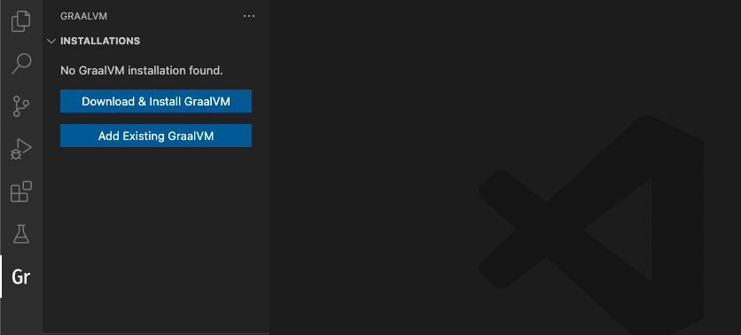
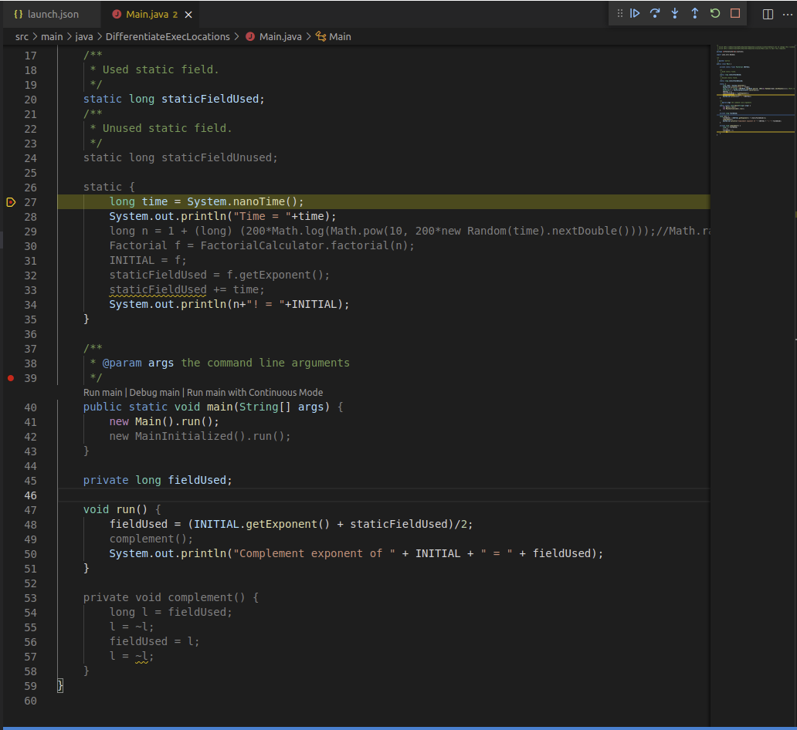

# GraalVM Tools for Java Extension

You want the power of Java and the ease of VS Code?
Level up your developer abilities by leveraging GraalVM in VS Code.

The GraalVM Tools for Java extension provides full-fledged support for the Java language, but it also includes the power of GraalVM, full
debugging capabilities, polyglot support, and lightning fast just-in-time as well as ahead-of-time compilers - all without ever leaving the comfort of VS Code.

<!-- insert some thrilling image from VS Code -->

The GraalVM Tools for Java extension does the work of several extensions in one. Key features include:
* Full-grown Java development support and debugging
* The GraalVM runtime, enabling you to run Java applications unmodified
* The just-in-time Graal compiler, ensuring your code runs fast
* The ahead-of-time compilation with GraalVM Native Image, to turn your Java application into tiny executables, perfect for storing in the cloud and microservices deployments
* The debugging of native Java proceses at run time
* Integration with VisualVM - for even easier and more powerful debugging
* Native support for the Micronaut framework
* Polyglot programming and debugging for polyglot applications, with support for JavaScript, Node.js, Python, R, and Ruby
* Built-in implementation of Debug Adapter Protocol (DAP)
* Smart editing features such as auto complete, go to declaration, and documentation on hover.

The power of VS Code just got boosted.

This extension makes VS Code a comfortable and convenient integrated development environment for developers.
Let's get started!

## Extension Installation

To install the GraalVM Tools for Java extension in VS Code:

1. Navigate to Extensions in the left-hand side Activity Bar (or use the _Ctrl+Shift+X_ hot keys combination).
2. Search for "GraalVM" in the search field.
3. Once found, click **Install**.
4. Reload when required.

## GraalVM Installation Wizard

After installing the extension, you can install GraalVM by using the built-in installation wizard (click the "Gr" icon in the left side Activity Bar).

You can either add an existing GraalVM installation (if you have GraalVM already), or download it immediately from within VS Code.
The **Download & Install GraalVM** action is preferable, as it eliminates the fuss around setting up environment variables and prepares the GraalVM runtime in VS Code for you.
Choose either the Community (free for all purposes) or Enterprise distribution (free for evaluation and development). You can also choose to install additional plugins (JavaScript and Node.js support, LLVM, etc.).

For more information about GraalVM installation and setup, check the [extension documentation](https://www.graalvm.org/dev/tools/vscode/graalvm-extension/#graalvm-installation-wizard).

## Java Development and Debugging

The GraalVM Tools for Java extension brings complete support for Java language development and debugging in VS Code, including popular features like auto completion, code navigation, and refactoring, etc.

Any application that runs on a JVM can run on GraalVM unmodified.
GraalVM includes a JDK based on the Java HotSpot VM, and integrates an optimizing, just-in-time (JIT) compiler, written in Java: the [Graal compiler](https://www.graalvm.org/dev/reference-manual/compiler/).

There are several launch configurations available by default, or you can add more.
Check the [extension documentation](https://www.graalvm.org/dev/tools/vscode/graalvm-extension/#java-development-and-debugging) to learn more.

## Integration with VisualVM

GraalVM Tools for Java extension provides integration with [VisualVM](https://visualvm.github.io), which is the all-in-one Java (and polyglot) monitoring and troubleshooting tool.
This brings powerful yet easy-to-use visual Java tooling to VS Code.

A special launch configuration - **Launch VisualVM & Java 8+ Application** - is provided by the GraalVM Tools for Java extension to start VisualVM along with the project.

Check the [dedicated guide](https://www.graalvm.org/dev/tools/vscode/graalvm/visualvm-integration/) about VisualVM and VS Code integration using the extension.

## Support for the Micronaut Framework

In combination with the GraalVM Tools for Micronaut extension, you can create Micronaut projects, run and debug them directly from VS Code with different debugging protocols.
This native support for the Micronaut framework allows to build native images of Micronaut projects right from VS Code.

Moreover, you can build Docker images with the application artifacts, or even build Docker images with GraalVM Native Images inside and deploy them to containers.

See the [GraalVM Tools for Micronaut extension documentation](https://www.graalvm.org/dev/tools/vscode/micronaut-extension/) to learn more.

## Native Image

The GraalVM download includes GraalVM Native Image, which allows you to ahead-of-time compile your Java code to a standalone executable - directly in VS Code.
Only the code that is required by the application at run time will be compiled and linked into the final native executable.
The advantages are many, especially for microservices.

Your application will:
* Be compiled into small executable files, using a fraction of customary resources - so they run lightning fast.
* Achieve super fast startup, achieving peak performance with no warmup time
* Have improved security by greatly reducing attack surfaces and thwarting reverse engineering

With GraalVM Tools for Java extension you can turn your Java projects into native executables directly in VS Code.
Learn how you can do that from the [extension documentation](https://www.graalvm.org/dev/tools/vscode/graalvm-extension/#native-image-building-and-debugging).
Read more about GraalVM Native Image [here](https://www.graalvm.org/dev/reference-manual/native-image/).

## Native Image Debugging

The GraalVM Tools for Java extension provides Java-like debugging of native executables in a running state directly from within VS Code.
You can set breakpoints, inspect the state of your application, even attach the debugger to a native image process in VS Code and step over the application source code!

Read more about this and find a demo application in the [Native Image Debugging guide](native-image-debugging.md).

## Polyglot Programming and Debugging

The GraalVM Tools for Java extension enables a polyglot environment in VS Code, providing necessary editing and debugging features for a number of popular languages such as Python, Ruby, R, JavaScript, and Node.JS.
The extension allows for polyglot programming in a bidirectional way: you can embed JavaScript, Ruby, R, and Python in Java, or call Java from those languages.
A host language and a guest language can directly interoperate with each other and pass data back and forth in the same memory space.

The GraalVM Tools for Java extension comes with full editing capabilities for JavaScript, Node.js, and Python by default. For editing Ruby and R in VS Code you will need to additionally install languages servers.
Thanks to GraalVM's [built-in implementation of the Language Server Protocol](https://www.graalvm.org/dev/tools/lsp/), smart editing features are added on top for those languages such as code-completion, find usages, go to declaration, CodeLens, documentation on hover, etc.

The debugging features are provided for all supported languages with no exceptions by default.

Proceed to the [dedicated guide](polyglot-runtime.md) to read about debugging JavaScript and Node.JS, Python, Ruby, R applications in VS Code, the Language Server Protocol implementation and editing features.

## Built-in Implementation of Debug Adapter Protocol (DAP)

Thanks to the built-in implementation of the [Debug Adapter Protocol (DAP)](https://www.graalvm.org/dev/tools/dap/), a user can choose a debugging protocol in VS Code by setting to either `chromeDevTools` or `debugAdapter`.
The advantage of using the Debug Adapter Protocol over Chrome Dev Tools is that (1) it is "native" to VS Code, meaning it does not require any intermediate translatation, and (2) it supports multithreading, which can be particually useful to debug, e.g., a Ruby application.

Check the documentation for more information on [Polyglot Programming and Debugging in VS Code](https://www.graalvm.org/dev/tools/vscode/graalvm-extension/polyglot-runtime/).

## Provide Feedback or Seek Help

* [Request a feature](https://github.com/graalvm/vscode-extensions/issues/new?labels=enhancement)
* [File a bug](https://github.com/graalvm/vscode-extensions/issues/new?labels=bug)

## Privacy Policy

Read the [Oracle Privacy Policy](https://www.oracle.com/legal/privacy/privacy-policy.html) to learn more.
