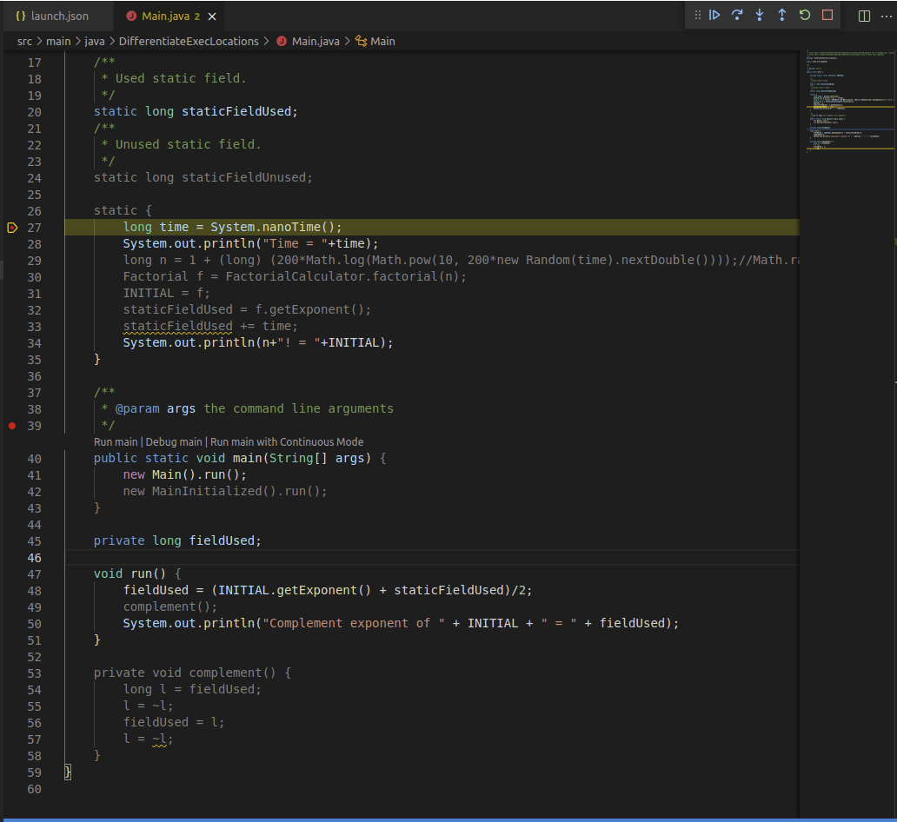

<!-- 1. Short description -->

# GraalVM Tools for Java Extension

GraalVM Tools for Java extension brings a full-fledged support for the Java language in VS Code.
This includes support for just-in-time (JIT) and ahead-of-time (Native Image) compilations, integration with VisualVM, all regular development and debugging capabilities.
Besides Java, this extension also enables a polyglot environment in VS Code, providing necessary editing and debugging features for JavaScript and Node.js, Python, R, and Ruby languages.

Some of the key features GraalVM Tools for Java extension provides:

* Full-grown Java development and debugging features
* Ahead-of-time compilation with GraalVM Native Image
* Debugging native images at run time
* Integration with VisualVM
* Different debugging protocols to choose from
* Native support for the Micronaut framework
* Polyglot programming and complete debugging experience for polyglot applications
* Support JavaScript and Node.js, Python, R, and Ruby languages by default
* Built-in implementation of Debug Adapter Protocol (DAP)
* Smart editing features like auto complete, go to declaration, or documentation on hover, and so on.

This extension makes VS Code a comfortable and convenient integrated development environment for developers.

<!-- 2. Extension and GraalVM installations  -->

## Extension Installation

To install the GraalVM Tools for Java extension in VS Code, do the following:

1. Navigate to Extensions in the left-hand side Activity Bar (or use the _Ctrl+Shift+X_ hot keys combination).
2. Search for "GraalVM" in the search field.
3. Once found, press Install. That action will install the GraalVM Tools for Java extension from the [VS Code Marketplace](https://marketplace.visualstudio.com/items?itemName=oracle-labs-graalvm.graalvm).
4. Reload when required.

Once installed, notice the "Gr" icon in the Activity Bar on the left.

## GraalVM Installation

With the extension installed, you already enable all necessary features for Java applications development and debugging.
However, to make use of all-inclusive capabilities that the extension provides, including support for ahead-of-time compilation, you need to install [GraalVM](https://www.graalvm.org/).
Any application that runs on a Java Virtual Machine (JVM) can run on GraalVM.
GraalVM includes a JDK based on the Java HotSpot VM, and integrates an optimizing, just-in-time (JIT) compiler, written in Java: the [Graal compiler](../../../reference-manual/java/compiler.md).
At run time, an application is loaded and executed normally by the JVM.

The GraalVM Tools for Java extension provides the wizard to install GraalVM.
Click the ""Gr" icon in the Activity Bar on the left.
A dialogue opens with the following choices:

* ** Download & Install GraalVM** will download and install any available GraalVM distribution.
* ** Add Existing GraalVM** lets you select an existing GraalVM installation from your local disk.

If you select **Download & Install GraalVM**, the installation wizard will ask you to:
* Pick the GraalVM distribution: Community (free for all purposes) or Enterprise (free for evaluation and development)
* Pick the GraalVM version: 22.x, 21.x, 20.x, or Latest Snapshot (Nightly Build)
* Pick a Java version: 11 or 17
* Select the destination folder

When the download completes or upon adding an existing GraalVM installation from your local disk, the "Set as Default Java" action is invoked.
To make a newly added GraalVM SDK active, click the "home" icon by the side of the installation:

At the same time, the "Install Optional GraalVM Components" window will pop up suggesting to install additional plugins to GraalVM:

> Note: You can download and install multiple GraalVM distributions and components at the same time.

The "Download & Install GraalVM" action is a preferable way, as it eliminates the fuss around setting up environment variables and prepares the GraalVM runtime in VS Code for you.
For more information about GraalVM installation and setup, check the [extension documentation](README.md#graalvm-installation).

<!-- 3. Get started with Java development and debugging -->

## Java Development and Debugging

GraalVM Tools for Java extension brings a complete support for the Java language development and debugging in VS Code.
Besides regular features like auto completion, code navigation, refactoring, etc., this extension provides support for ahead-of-time compilation with GraalVM Native Image, integrates with VisualVM, and allows polyglot programming, which will be described later.

To start developing, compile, run or debug your Java applications, GraalVM should be the default Java runtime in VS Code.
You can install GraalVM as described in the [GraalVM Installation](README.md#graalvm-installation) section (the recommended way).
You can also specify the path to GraalVM manually, by editting the `java.home` setting in VS Code.
If not specified, it is searched on the current system path.
If the path is not pointing to the GraalVM folder, go to User Settings and use the `netbeans.jdkhome` value in the _settings.json_ file.
This configuration is then used to launch the Java Language Server.

The project you create from scratch or a Java project you open in VS Code will then run on GraalVM.

To debug a Java application running on GraalVM, create a launch configuration, which is absolutely straightforward.
Open the file to be debugged or run, switch to the Debug view by clicking on the "bug" icon in the left-hand side panel.
The newly opened window will suggest you create a _launch.json_ file. Select the **"Java 8+" environment**:

To start debugging, press F5 or navigate to **Run > Start Debugging**.

There are several launch configurations available by default, but you can add more.
Check the [extension documentation](README.md#java-development-and-debugging) to learn more.

<!-- 4.  VisualVM Integration -->

## Integration with VisualVM

GraalVM Tools for Java extension provides integration with [VisualVM](https://visualvm.github.io), which is the all-in-one Java (and polyglot) monitoring and troubleshooting tool.
This brings the visual Java tooling to VS Code.
A special launch configuration **Launch VisualVM & Java 8+ Application** is provided by the GraalVM Tools for Java extension to start VisualVM along with the project.

The prerequisite is the latest stable GraalVM installed in VS Code (see the [GraalVM Installation section](#graalvm-installation)).
Once a GraalVM installation is set as **active**, the Command Palette contains the following commands related to VisualVM:

Check the [dedicated guide](visualvm-integration.md) about VisualVM and VS Code integration using the extension.

<!-- 5.  Ahead-of-time compilation with GraalVM Native Image -->

## Native Image Support

<!-- Alternatively, we can start with: With GraalVM Tools for Java extension you can turn your Java projects into native executables directly in VS Code. -->

With GraalVM Tools for Java extension you can build cloud native Java applications directly in VS Code.
The extension provides support for ahead-of-time compilation with GraalVM Native Image.
GraalVM Native Image allows to turn your Java application into a self-contained native executable.
Only the code that is required by the application at run time will be compiled and linked into the final native executable.
Learn more about GraalVM Native Image [here](../../../reference-manual/native-image/README.md).

### Native Image Configuration

A native image is built ahead of runtime and the build relies on the static analysis of which code will be reachable.
However, this analysis cannot always completely predict dynamic features like Java Reflection calls, Dynamic Proxy objects, etc.
Undetected usages of dynamic features need to be pre-configured, otherwise they will not be included in the native image.

GraalVM Tools for Java extension provides the experimental support for the Java [Tracing agent](../../../reference-manual/native-image/Agent.md) to automate the process of tracking and registering dynamic feature calls.
The agent generates configuration files that record all calls whilst your application is running on a JVM.

A special launch configuration **Launch Native Image Agent & Java 8+ Application** is provided by the GraalVM Tools for Java extension to start a Java project with the Tracing agent.
This makes it even easier to build native images in VS Code.

Check the extension documentation to learn [how to build a native image and apply the Tracing agent from within VS Code](README.md#build-a-native-image).

### Native Image Debugging

With the GraalVM Tools for Java extension, you can debug Java applications running as native images from within VS Code.
This extension provides Java-like debugging of native images in VS Code.
You can set breakpoints, create watches, inspect the state of your application, etc.

There are two ways to debug a native image:
  * debugging a running native image process directly from within [Visual Studio Code](https://code.visualstudio.com/)
  * using the GNU Debugger, `gdb`, from the command line

Since recently you can attach the debugger to a native image process in VS Code and step over the application source code!
Attaching of debugger is done by adding a separate configuration **Native Image: launch** into the _launch.json_ file.
VS Code will execute your native image, attach to the application process, open the Java source file, letting you debug it.

You can set breakpoints, step over the code, explore local variables, specify expressions to be evaluated, etc., everything as you would do to debug a Java application.
Read more about this and find a demo application in the [Native Image Debugging guide](../../../reference-manual/native-image/Debugging.md).

To use the GNU Debugger, the native image should contain debug information in a format `gdb` understands.
Read more how to gebug a Native Image with GDB [here](../../../reference-manual/native-image/Debugging.md).

<!-- 6. Popular Languages Support or GraalVM Languages Support or Features -->

## Polyglot Programming Support OR Popular Languages Support

<!-- Besides enabling a complete development environment for Java, GraalVM Tools for Java extension also provides full support for a number of popular languages such as
JavaScript, Ruby, R, Python. -->

GraalVM Tools for Java extension enables a polyglot environment in VS Code, providing necessary editing and debugging features for a number of popular languages such as Python, Ruby, R, JavaScript and Node.JS.
The extension allows for polyglot programming in a bidirectional way: you can embed JavaScript, Ruby, R, Python in Java, or call Java from those languages.

A language server is started as a part of every process being executed or debugged via the VS Code user interface.
GraalVM Tools for Java extension checks for the language server, an implementation of the [Language Server Protocol](https://microsoft.github.io/language-server-protocol/) for a particular language, and provides an option to automatically install it.

Using [GraalVM](#graalvm-installation), the extension allows for developing, running, and debugging applications written in JavaScript and Node.js, Python, Ruby, and R lnguages. Check the dedicated guide how to run and debug JavaScript and Node.js, Python, Ruby, and R applications with GraalVM Tools for Java extension in VS Code:
* [JavaScript and Node.js](polyglot-runtime.md#javascript-and-nodejs-support)
* [Python](polyglot-runtime.md#python-support)
* [Ruby](polyglot-runtime.md#ruby-support)
* [R](polyglot-runtime.md#r-support)

Thanks to GraalVM's [built-in implementation of the Language Server Protocol](https://www.graalvm.org/22.0/tools/lsp/), smart editing features are provided for the guest languages like code-completion, find usages, go to declaration, documentation on hover, etc.

<!-- The following can be removed and used in README only: -->
The following services are supported:
  - Text Document Synchronization
  - Hover Provider
  - Completion Provider
  - Signature Help Provider
  - Document Highlight Provider
  - Code Action Provider
  - Code Lens Provider
  - Execute Command Provider

<!-- 7.  Popular Languages Debugging and Debug Adapter Protocol -->

## Polyglot Debugging Support OR Popular Languages Support

Thanks to the GraalVM's built-in implementation of the [Debug Adapter Protocol (DAP)](https://www.graalvm.org/22.0/tools/dap/), a user can choose a debugging protocol in VS Code by setting to either `chromeDevTools` or `debugAdapter`.

<!-- The debug configurations differ per supported language. -->

The advantage of using the Debug Adapter Protocol over Chrome Dev Tools is that (1) it is "native" to VS Code, meaning it does not require any intermediate translatation, and (2) it supports multithreading, which can be particually useful to debug, e.g., a Ruby application.

Check the documentation for more information on [Polyglot Programming and Debugging in VS Code](polyglot-runtime.md)

<!-- 8.  Extension Settings – a bullet list -->
## Extension Settings

This extension contributes the following settings:

* __graalvm.home__ - the path to the GraalVM installation
* __graalvm.installations__ - all registered GraalVM installations
* __graalvm.systemDetect__ - detect GraalVM's installation from the system environment variables
* __graalvm.languageServer.currentWorkDir__ - an absolute path to the working directory of GraalVM's Language Server Protocol
* __graalvm.languageServer.inProcessServer__ - start GraalVM's Language Server Protocol within processes being run or debugged
* __graalvm.languageServer.delegateServers__ - a comma-separated list of `language@[host:]port` where other language servers run
* __graalvm.languageServer.startRLanguageServer__ - start the R Language Server
* __graalvm.languageServer.startRubyLanguageServer__ - start the Ruby Language Server

### Provide Feedback or Seek Help

* [Request a feature](https://github.com/graalvm/vscode-extensions/issues/new?labels=enhancement)
* [File a bug](https://github.com/graalvm/vscode-extensions/issues/new?labels=bug)

### Privacy Policy

Read the [Oracle Privacy Policy](https://www.oracle.com/legal/privacy/privacy-policy.html) to learn more.
