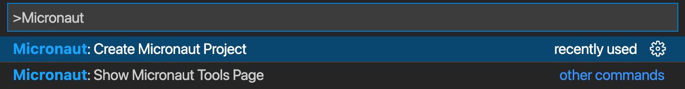
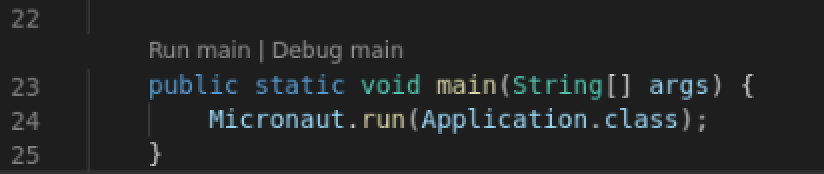
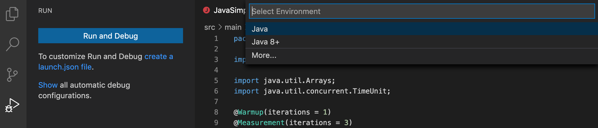
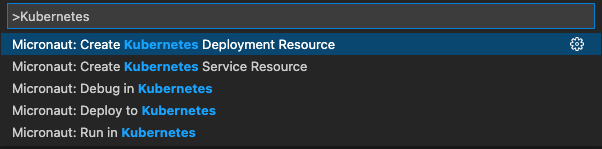
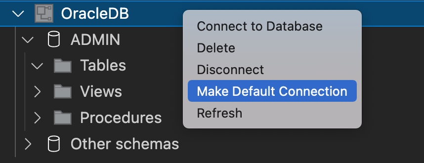
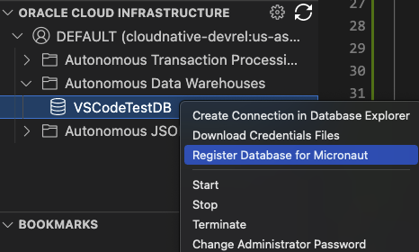

# GraalVM Tools for Micronaut Extension

[GraalVM Tools for Micronaut](https://marketplace.visualstudio.com/items?itemName=oracle-labs-graalvm.micronaut) provides support for developing Micronaut applications with Visual Studio Code (VS Code).

The [Micronaut framework](https://micronaut.io/) is a lightweight reactive framework that provides a solid foundation for building cloud native Java microservices. Thanks to [Micronaut Data](https://micronaut-projects.github.io/micronaut-data/latest/guide/), the database access toolkit, you can access the database and execute queries. 

While being a Technology Preview release, the extension already provides many features to boost your Java 8+ and Micronaut productivity in the VS Code environment:

- Micronaut application creation wizard
- Code completion and navigation for Micronaut configuration (YAML) files
- Different language development features like Javadoc on hover, refactorings, go to definition etc.
- Debugging capabilities
- CodeLens for continuous mode of operation (running Micronaut project and reloading automatically when source code is changed)
- Support for Maven and Gradle projects
- Quick commands to create and deploy Docker images
- Kubernetes deployments
- Database support

While the extension delivers all these features on its own, it works best when used together with the [GraalVM Tools for Java extension](https://marketplace.visualstudio.com/items?itemName=oracle-labs-graalvm.graalvm). You get all the GraalVM-specific features like the innovative Graal compiler for better performance, ahead-of-time compilation with GraalVM Native Image, debugging with different protocols, built-in VisualVM, and many more.

## Extension Installation

The prefered way is installing the **GraalVM Tools for Micronaut** extension via the **GraalVM Extension Pack for Java**. The extension pack also ships the **Apache NetBeans Language server** and **GraalVM Tools for Java** extension.

If you install GraalVM Tools for Micronaut extension, the others will be installed for you in the background: 

1. Navigate to Extensions in the left-hand side Activity Bar (or use the Ctrl+Shift+X hot keys combination).
2. Search for "Micronaut" in the search field.
3. Find ***GraalVM Tools for Micronaut Extension** and click Install.
4. Reload when required.

The entrypoint to the Micronaut extension is the Micronaut Tools page which opens as soon as the extension is installed or using the Command Palette command **Micronaut: Show Micronaut Tools Page**.

 

## Extension Settings

The GraalVM Tools for Micronaut extension contributes to the following settings in VS Code:

* __micronaut.home__ - the optional path to the Micronaut CLI installation
* __micronaut.showWelcomePage__ - show the Micronaut Tools Page on extension activation

## Micronaut Project Creation Wizard

The extension provides two possibilities to create a new Micronaut project: using the [Micronaut Launch](https://micronaut.io/launch/) service or using a local Micronaut CLI installation.

To create a new project using the project creation wizard, go to  **View**, **Command Palette**, search for "micronaut" and invoke the **Micronaut: Create Micronaut Project** command. Then follow the prompts.
It supports generating Micronaut applications, CLI applications, and other types of applications. 

  

Check the [extension documentation](https://www.graalvm.org/tools/vscode/micronaut-extension/) for more information.

## Running and Debugging Micronaut Applications

The GraalVM Tools for Micronaut extension provides complete support for application development and debugging in VS Code for Micronaut developers, including regular features like auto completion, code navigation, refactoring, etc.

You can package a Micronaut application into a runnable JAR and run it in different ways:
- Invoking special quick commands

   

- Calling Maven or Gradle jobs explicitly from the command line
- Running the application `main` method

    

The default nature of the Micronaut framework offers reduced use of Java reflection, runtime proxy generation, and dynamic classloading. It results in performance, memory and startup improvements, and makes it easier to debug Micronaut applications.

To run the Micronaut application in debug mode, switch to the **Run and Debug** view by clicking on the bug icon in the left-hand side panel, select the **Java 8+** environment:

 

It will run your current Micronaut project, letting you debug it.

## Ahead-of-time Compilation with GraalVM Native Image

The Micronaut support in combination with [GraalVM Tools for Java extension](https://marketplace.visualstudio.com/items?itemName=oracle-labs-graalvm.graalvm) opens many more possibilities for Java developers. Thanks to the tight integration with [GraalVM Native Image](../../../reference-manual/native-image/README.md), you can convert a Micronaut application into a native executable, which has significant benefits, particularly for serverless and microservice workloads.  

As long as the current active GraalVM installation has its Native Image component installed, your Micronaut application can be easily converted into a native binary using a single Command Palette command **Micronaut: Build Native Image**. There is also a possibility to create a native executable inside of a Docker image using the **Micronaut: Build…** command and selecting the appropriate **dockerBuildNative** target.

Least but not last, you can debug your Micronaut application launched as a native executable from VS Code! To enable the debugging mode, you have to add the debugger configuration, **Native Image: launch**, into the `launch.json` file. Once you have the configuration added, set breakpoints in application's Java source file, go to **Run and Debug** activity pane, select **Launch Native Image** and click the green arrow to run. VS Code will launch your native executable, attach to the process, letting you debug it exactly as you would debug any other Java program from within your IDE. You can set breakpoints, step over code, explore local variables etc. Learn more about debugging native executales [here](https://www.graalvm.org/tools/vscode/graalvm-extension/debugging-native-image/).

## Docker Support

With this extension, you can build a Docker image of a Micronaut application, or even create a Docker image containing an executable generated by [GraalVM Native Image](https://www.graalvm.org/reference-manual/native-image/) and deploy it in a container. 

Build and push Docker images to a Docker registry from VS Code:

  

A particular Docker Registry can be configured in the build, see the [Micronaut Deploying Application](https://micronaut-projects.github.io/micronaut-maven-plugin/latest/examples/deploy.html) documentation.

## Kubernetes Support

GraalVM Tools for Micronaut provides all of the necessary tooling for a complete developer experience in VS Code, including Kubernetes support for automated deployment, scaling and management of containers. 
You can deploy a containerized Micronaut application into a Kubernetes cluster to a container registry, interactively run and debug it directly from VS Code. The following quick commands are available for you:

  

To learn more, [check this guide](https://www.graalvm.org/tools/vscode/micronaut-extension/#deploy-and-run-micronaut-applications-in-a-kubernetes-cluster) that walks you through deploying a Micronaut application with [Oracle Container Engine for Kubernetes (OKE)](https://www.oracle.com/uk/cloud-native/container-engine-kubernetes/).

## Database Support

The GraalVM Tools for Micronaut extension provides out of the box integration with databases.
The database management can be done using the **DATABASES** explorer which finds available connections and allows you to connect to a database using the appropriate JDBC driver.
The database support covers the whole development workflow from creating a database, adding a connection, to setting up the runtime environment for a Micronaut application with the selected database. 
You can generate `@Entity` classes from an existing database schema, and use SQL code completion in the `@Query` annotation.

  

## Integration with Oracle Cloud and Oracle Autonomous Database

This extension is the best solution to "communicate" with and transfer data to Oracle Cloud immediately from within VS Code. 
Thanks to the **CLOUD** explorer, you can create and/or connect to [Oracle Autonomous Database](https://www.oracle.com/autonomous-database). 
The extension integrates with [Oracle Developer Tools for VS Code (SQL and PLSQL)](https://marketplace.visualstudio.com/items?itemName=Oracle.oracledevtools) which enables you to add JDBC connection to the database.

  

## Provide Feedback or Seek Help

* [Request a feature](https://github.com/graalvm/vscode-extensions/issues/new?labels=enhancement)
* [File a bug](https://github.com/graalvm/vscode-extensions/issues/new?labels=bug)

## Privacy Policy

Read the [Oracle Privacy Policy](https://www.oracle.com/legal/privacy/privacy-policy.html) to learn more.