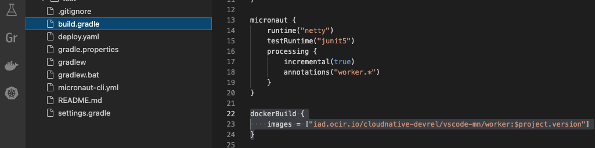
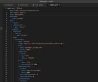

# Deploy Micronaut Applications to Oracle Container Engine for Kubernetes

GraalVM Tools for Micronaut Extension added support for working with Kubernetes clusters based on Microsofts’s [Visual Studio Code Kubernetes Tools](https://marketplace.visualstudio.com/items?itemName=ms-kubernetes-tools.vscode-kubernetes-tools).

It is now possible to deploy and debug a Micronaut project to Kubernetes on Oracle Cloud with Oracle Container Engine for Kubernetes (OKE)](https://www.oracle.com/uk/cloud-native/container-engine-kubernetes/) environment.
OKE is a fully-managed, scalable, and highly available service that you can use to deploy your containerized applications to the cloud.

This guide will walk you through the process of deploying a Micronaut application to OKE from VS Code and debugging it.

### Prerequisites
- [Visual Studio Code Kubernetes Tools](https://marketplace.visualstudio.com/items?itemName=ms-kubernetes-tools.vscode-kubernetes-tools)
- [Docker](https://docs.docker.com/engine/reference/run/)
- [Oracle Cloud Account][https://www.oracle.com/uk/cloud/free/]
- [Access to Oracle Container Engine for Kubernetes (OKE)](https://oracle.github.io/learning-library/oci-library/oci-hol/OKE/workshops/freetier/index.html?lab=intro)

## Preparation

### Visual Studio Code Kubernetes Tools
Micronaut's extension support for Kubernetes is based on Microsofts’s [Visual Studio Code Kubernetes Tools](https://marketplace.visualstudio.com/items?itemName=ms-kubernetes-tools.vscode-kubernetes-tools). It has to be installed.

Open Extensions tab, search for "Kubernetes" and install the one from Microsoft. Once installed, you should see the Kubernetes icon in the left sidebar:


### Oracle Cloud Account

If you have not got an active Oracle Cloud account, create one by following this [link](https://docs.oracle.com/en/cloud/get-started/subscriptions-cloud/csgsg/get-oracle-com-account.html).

### Access to Oracle Container Engine for Kubernetes (OKE)

Supposedly, you have signed in to your Oracle Cloud account.
To be able to deploy Docker images to Oracle Container Registry, you need to setup the access to Oracle Container Engine for Kubernetes (OKE).

#### Step 1: Create a Kubernetes cluster in OCI

Using the Oracle Cloud Console, create a Kubernetes cluster with default settings using the *Quick Create* workflow:

1. In the Oracle Cloud Console, open the navigation menu and click **Developer Services**.
2. Under Containers, click **Kubernetes Clusters (OKE)**.
3. Then click **Create Cluster**.

For more information, check this [guide](https://docs.oracle.com/en-us/iaas/Content/ContEng/Tasks/contengcreatingclusterusingoke_topic-Using_the_Console_to_create_a_Quick_Cluster_with_Default_Settings.htm).

#### Step 2: Set up access to Kubernetes cluster

You can access your Kubernetes cluster and manage it using `kubectl`.
To do that you have to set up a Kubernetes configuration file, _kubeconfig_.
The kubeconfig file (by default stored and can be found in the _$HOME/.kube/config_) provides the necessary details to access the cluster.

See the [Setting Up Local Access to Clusters](https://docs.oracle.com/en-us/iaas/Content/ContEng/Tasks/contengdownloadkubeconfigfile.htm#localdownload) guide for step-by-step instructions.

### Log in to Docker

To able to dockerize your Micronaut project, push and pull images on a local machine, and deploy to Oracle Container Registry, you will need [Docker](https://docs.docker.com/engine/reference/run/).
To check whether [Docker](https://docs.docker.com/engine/reference/run/) is started and running on your computer, go to VS Code Terminal and type: `docker --help`.

Next you need to login with Docker to your Oracle Container Registry.
Prepare following Oracle Cloud account credentials:

- Oracle Cloud Infrastructure (OCI) tenancy name
- User email address used for OCI account
- OCI authentification token
- OCI region key

From VS Code Terminal window, log in using the following command:
```bash
docker login -u <tenancy-namespace>/<oci-user-email> -p <auth token> <region-key>.ocir.io
```
For example, if your OCI region is US East (Ashburn), then the key will be `iad`, and the region endpoint will be `https://iad.ocir.io`.
The list of available regions and their keys is available [here](https://docs.oracle.com/en-us/iaas/Content/Registry/Concepts/registryprerequisites.htm).

> NOTE: If the Docker registry is private you will need a Docker registry secret.

This [guide](https://docs.oracle.com/en-us/iaas/Content/ContEng/Tasks/contengpullingimagesfromocir.htm) describes how to create a Docker registry secret and describes how to specify the image to pull from Oracle Cloud Infrastructure Registry (along with the Docker secret to use) during application deployment to a cluster you've created using OKE.

### Specify the Location for Docker Image in Oracle Container Registry

The location where to push your Docker image in Oracle Container Registry should be specified in the project configuration file.

If you used Gradle to build your Micronaut project, open the _gradle.build_ file and update image location:
  ```xml
  dockerBuild {
  images = ["<region-key>.ocir.io/<tenancy-namespace>/<repo-name>/<image-name>:<tag>"]
  }
  ```

See, for example, this example project configuration:


If you used Maven to build your Micronaut project, open _pom.xml_, find the `dockerBuild` task and update the image location:
    ```xml
    ```

## Deploy a Micronaut Application to OKE

To create a a Kubernetes deployment and deploy a Micronaut application to OKE, the following quick actions for Micronaut are available:


You should start by creating a `deploy.yml` script that will be applied at the deployment stage.

1. Go to View > Command Palette, search for "Kubernetes" and invoke the **Micronaut: Create Kubernetes Deployment Resource** action.

2. You will be prompted to select which Docker image to be used:
    
    Currently, images available are not automatically detected, so you need to type it manually.
    Grab the image location from _gradle.build_ or _pom.xml_ you specified in the **Specify the Location for Docker Image in Oracle Container Registry** step.

3. Then select a secret for a container registry in OCI (needed only if the Docker registry is private, described in the **Preparation** > **Log in to Docker** section):

    

    The `Deploy.yaml` will be created. It will look similar to the following:

    

Now you are ready to deploy your Micronaut application to OKE.

1. Go to View > Command Palette, search for **Micronaut: Deploy to Kubernetes Cluster** action and invoke it.
   You could have skipped steps 1-3 from above, but if no Kubernetes deployment file exists, VS Code will suggest you to create one at this step.

2. Once you invoke the action, the Output window will open and the "Starting deploy of project" message will be printed.

When you hit this action, the project is packaged with Gradle/Maven to a JAR file, then built into a Docker image, and, finally, Docker pushes this image to OKE repository (Oracle Container Registry), by applying the _deploy.yaml_ script.
Once the deployment is ready, the job creates a port to a local host and prints out the URL, so you can access your REST application from a browser.
All this can be tracked in the Output window.

You can work on other projects, deploy them to another Kubernetes clusters, and they will all be deployed and running from Oracle Container Registry.

## Debug Micronaut Applications in Remote Kubernetes Cluster

In addition to being able to deploy Micronaut applications to a Kubernetes cluster directly from VS, you can also debug your Java application in a remote Kubernetes cluster.

For that you need to ensure the [GraalVM Extension Pack for Java](https://marketplace.visualstudio.com/items?itemName=oracle-labs-graalvm.graalvm) is installed.
It is not needed if you have installed [GraalVM Tools for Java Extension pack](https://marketplace.visualstudio.com/items?itemName=oracle-labs-graalvm.graalvm-pack), it already includes a full-fledged support for the Java and Micronaut.

1. Go to View > Command Palette, search for **Micronaut: Debug in Kubernetes** action and invoke it.
2. Connect the Kubernetes extension to your Kubernetes cluster using **Set Kubeconfig** action.
3. Click on Kubernetes icon in the left sidebar and select the node you are developing.
4. Right-click invoke action Debug (Attach using Java 8+):


