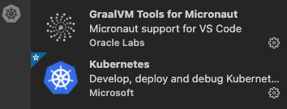
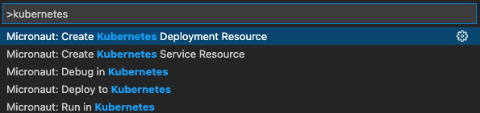
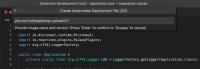
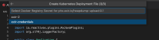
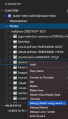

# Deploy Micronaut Applications to Kubernetes

GraalVM Tools for Micronaut Extension added support for working with Kubernetes clusters based on Microsofts’s [Visual Studio Code Kubernetes Tools](https://marketplace.visualstudio.com/items?itemName=ms-kubernetes-tools.vscode-kubernetes-tools).

It is now possible to create a Kubernetes deployment, deploy and debug a Micronaut project to Kubernetes on OCI - [Oracle-managed Container Engine for Kubernetes (OKE)](https://www.oracle.com/uk/cloud-native/container-engine-kubernetes/) environment.
OKE is a fully-managed, scalable, and highly available service that you can use to deploy your containerized applications to the cloud.

This guide will walk you through the process of deploying a Micronaut application to OKE from VS Code and debugging it.

### Prereuiqistes
- [Visual Studio Code Kubernetes Tools](https://marketplace.visualstudio.com/items?itemName=ms-kubernetes-tools.vscode-kubernetes-tools)
- [Oracle Cloud Account][https://www.oracle.com/uk/cloud/free/]
- [Oracle Container Engine for Kubernetes (OKE)](https://oracle.github.io/learning-library/oci-library/oci-hol/OKE/workshops/freetier/index.html?lab=intro)
- [Docker](https://docs.docker.com/engine/reference/run/)

You should dockerize your Micronaut project to deploy to a Kubernetes cluster.
Once you have a Docker image of your project, follow these steps to deploy it to OKE:

## Preparation

GraalVM Tools for Micronaut Extension support for Kubernetes based on Microsofts’s [Visual Studio Code Kubernetes Tools](https://marketplace.visualstudio.com/items?itemName=ms-kubernetes-tools.vscode-kubernetes-tools). It has to be installed.

1. Open Extensions tab, search for "Kubernetes" and install the one from Microsoft. Once installed, you should see the Kubernetes icon in the left sidebar:


Next you should check [Docker](https://docs.docker.com/engine/reference/run/) is started and running on your computer. Go to VS Code Terminal and type: `docker --help`.
To able to dockerize your Micronaut project, push and pull images on a local machine, and deploy to a Kubernetes cluster, you will need [Docker](https://docs.docker.com/engine/reference/run/).

1. To quickly check if Docker is started and running on your computer, go to VS Code Terminal and type: `docker --help`.

Before you can push and pull Docker images to and from OKE (also known as Container Registry), you must have access:
- have access to an Oracle Cloud Infrastructure tenancy
- have access to the Docker CLI
- have an Oracle Cloud Infrastructure auth token

Supposedly, you have signed in to your Oracle Cloud account and have necessary access details.
To be able to deploy Docker images to (OCI) Container Engine for Kubernetes (OKE), you need to setup the access to Oracle Container Registry, which includes.

**Log in to Docker with your Oracle Cloud credentials**
To login to Docker using your Oracle credentials and the following syntax:
```bash
docker login -u <tenancy-namespace>/<oci-user-email> -p <auth token> <region-key>.ocir.io
```
For example, your OCI region is US East (Ashburn), then the key will be `iad`, and the region will be `https://iad.ocir.io`.
The list of available regions and their is available [here](https://docs.oracle.com/en-us/iaas/Content/Registry/Concepts/registryprerequisites.htm).

**Confugire access to Oracle Cloud CLI**
Second, you need to confugire access to Oracle Cloud CLI.

**Create a Kubernetes cluster in OCI**
Third, you need to create a Kubernetes cluster.

**Configure access to your cluster with kubectl config file**

## Deploy a Micronaut application to OKE

To create a a Kubernetes deployment and deploy a Micronaut application to OKE, the following quick actions for Micronaut are available:



1. Go to View > Command Palette, search for **Create Kubernetes Deployment Resource** action and invoke it:

2. You will be prompted to select which Docker image to be used:


Currently, images available are not automatically detected, so you need to type it manually. 

3. Then select a secret for a container registry in OCI:



The `Deploy.yaml` will be created. It will look similar to the following:


3. Then you can deploy. Go to View > Command Palette, search for **Deploy to Kubernetes Cluster** action and invoke it.
You could have skipped steps 1-3, but if no Kubernetes deployment file exists, VS Code will suggest you to create one at this step.

## Attach to Remote Debugger from OKE

In addition to being able to deploy to a Kubernetes cluster and create Kubernetes deployments for Micronaut applications from VS, you can also attach to a remote Kubernetes cluster and debug your Java 8 and up application right from VS Code.
For that you need to ensure the [GraalVM Extension Pack for Java](https://marketplace.visualstudio.com/items?itemName=oracle-labs-graalvm.graalvm) is also installed.
It is not needed if you have installed [GraalVM Tools for Java Extension pack](https://marketplace.visualstudio.com/items?itemName=oracle-labs-graalvm.graalvm-pack), it already includes a full-fledged support for the Java and Micronaut.

1. When deployed it is possible to debug this K8s node using Kubernetes Extension
2. Connect Kubernetes extension to your K8s cluster using Set Kubeconfig
3. Then select the node you are developing and invoke action Debug (Attach using Java 8+):


This will perform kubectl portforward and debugging remote K8s pod using kubectl port forwarding capabilities.

To get started, you need to get the latest stable GraalVM release using the Download & Install GraalVM action from the Gr activity view, as described in the Installation and Setup section. Make sure the GraalVM is set as the active.
Once a GraalVM installation is set as active, the Command Palette contains the following commands related to VisualVM:

Once a GraalVM installation is set as active, the Command Palette contains the following commands related to VisualVM:
